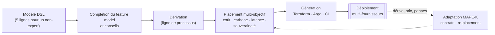

# amlops : DSL MLOps adaptatif (ANR AdaptiveMLOps, prototype du partenaire industriel)

<p align="center">
  <a href="https://anr.fr/Projet-ANR-24-IAS2-0004"></a>&nbsp;&nbsp;&nbsp;
  <a href="https://dhm.euromov.eu/"></a>&nbsp;&nbsp;&nbsp;
  <a href="https://www.lirmm.fr/"></a>&nbsp;&nbsp;&nbsp;
  <a href="https://www.getcaas.io/"><picture><source media="(prefers-color-scheme: dark)" srcset="docs/assets/logos/getcaas-white.png"></picture></a>
</p>

[English](README.md) | **Français**

`amlops` compile une description courte et consciente de la variabilité d'un
pipeline MLOps en Infrastructure- et Platform-as-Code (Terraform, Argo Workflows /
Argo Events, Kubernetes, CI), place ses étapes sur plusieurs fournisseurs cloud selon
des objectifs de coût, de carbone, de latence et de souveraineté, et l'adapte à
l'exécution (détection de dérive, contrats de coordination exécutables,
re-placement).

C'est la contribution de GetCaaS au projet ANR **AdaptiveMLOps**
(ANR-24-IAS2-0004). Elle s'appuie sur les résultats du consortium : les six
catégories de variabilité et les exigences R1–R8 de *Toward Adaptive MLOps:
Variability Mapping and Modeling* (GdR GPL 2025, hal-05127859) et les 38 activités
et contrats de coordination de **SkeltyMLOps** (MLOps@ECAI 2025, hal-05337700 ;
FGCS 185 (2026) 108700).

> **Statut : prototype de recherche, v0.1.** Le catalogue des fournisseurs
> (`src/amlops/knowledge/providers.yaml`) contient des prix, puissances et
> intensités carbone *illustratifs*, et les expériences dynamiques utilisent des
> traces *synthétiques*. Les artefacts Terraform/Kubernetes générés sont analysés et
> testés unitairement mais n'ont pas été déployés. Le feature model et ses règles
> sont une proposition en attente de revue par le consortium.

## Le projet AdaptiveMLOps

| | |
|---|---|
| Titre | **MLOps Adaptatif** (AdaptiveMLOps) |
| Financement | Agence nationale de la recherche (ANR), convention **ANR-24-IAS2-0004** |
| Appel | AAP 2024 *Thématiques Spécifiques en Intelligence Artificielle* (TSIA) : Machine Learning Operations, Génie logiciel pour l'intelligence artificielle |
| Aide ANR | 489 646 € |
| Début / durée | septembre 2024 / 48 mois |
| Coordinateur | Sylvain Vauttier (EuroMov Digital Health in Motion) |

**Objectif.** Le MLOps étend les principes DevOps à la science des données et à
l'apprentissage automatique, afin d'entraîner, de déployer et d'exploiter les modèles
d'IA comme des composants logiciels ordinaires. Un enjeu central est
l'*entraînement continu* des modèles pour les adapter aux évolutions observées dans
les données de production (dérives de données et de concept). AdaptiveMLOps étudie
comment les concepts de l'ingénierie du domaine (feature models, lignes de produits
logiciels) permettent de capturer les points communs des processus MLOps et de
documenter les bonnes pratiques, puis exploite cette connaissance pour guider la
conception de nouveaux pipelines par une approche dirigée par les modèles : un
langage dédié (DSL) à la fois (i) générique et extensible, (ii) suffisamment
abstrait pour des utilisateurs non experts, (iii) paramétrable finement par les
experts et (iv) pivot pour générer du Platform-as-Code / Infrastructure-as-Code. Le
projet vise le (re)déploiement automatique et dynamique de composants de pipeline
hébergés chez plusieurs fournisseurs, en optimisant l'efficacité, le coût et
l'empreinte environnementale. Les propositions sont prototypées et validées par des
preuves de concept sur la plateforme cloud du partenaire industriel.

**Consortium.**

| Partenaire | Rôle | Site |
|---|---|---|
| EuroMov Digital Health in Motion (EuroMov DHM), Université de Montpellier & IMT Mines Alès | Coordinateur | <https://dhm.euromov.eu/> |
| LIRMM, Laboratoire d'Informatique, de Robotique et de Microélectronique de Montpellier (Université de Montpellier, CNRS) | Partenaire académique | <https://www.lirmm.fr/> |
| GetCaaS | Partenaire industriel (ce dépôt) | <https://www.getcaas.io/> |

<p align="center">
  <a href="https://www.imt-mines-ales.fr/"></a>&nbsp;&nbsp;&nbsp;
  <a href="https://www.umontpellier.fr/"></a>&nbsp;&nbsp;&nbsp;
  <a href="https://www.cnrs.fr/"></a>
</p>

**Liens officiels.**
- Fiche du projet sur le site de l'ANR : <https://anr.fr/Projet-ANR-24-IAS2-0004>
- Site du projet : <https://adaptivemlops.wp.imt.fr/>
- IMT Mines Alès : <https://www.imt-mines-ales.fr/>, Université de Montpellier : <https://www.umontpellier.fr/>, CNRS : <https://www.cnrs.fr/>

**Publications du consortium sur lesquelles s'appuie ce travail.**
- C. El Hatimi et al., *Toward Adaptive MLOps: Variability Mapping and Modeling*, Journées nationales du GdR GPL, Pau, 2025. <https://hal.science/hal-05127859>
- C. Daoud et al., *SkeltyMLOps: Orchestrating Collaborative MLOps Activities*, MLOps25 @ ECAI 2025, CEUR-WS vol. 4109. <https://hal.science/hal-05337700>
- C. Daoud et al., *A reference architecture for an orchestrated collaborative MLOps*, Future Generation Computer Systems 185 (2026) 108700. <https://doi.org/10.1016/j.future.2026.108700>

## Vue d'ensemble



Architecture scientifique et logicielle détaillée, avec les schémas du feature
model, de la ligne de processus, du problème de placement, de la boucle
d'adaptation et des contrats de coordination :
[docs/ARCHITECTURE.fr.md](docs/ARCHITECTURE.fr.md).

## Démarrage rapide

```bash
pip install -e ".[dev,experiments]"
amlops knowledge                                         # contenu de la base de connaissances
amlops validate examples/churn_novice.amlops.yaml        # constats de bonnes pratiques
amlops place    examples/churn_novice.amlops.yaml --pareto
amlops generate examples/churn_novice.amlops.yaml -o out/churn
amlops simulate examples/predictive_maintenance_expert.amlops.yaml
pytest -q                                                # 35 tests
python experiments/run_all.py                            # régénère tous les chiffres de l'article
```

Un modèle non expert tient en cinq lignes :

```yaml
amlops: "0.1"
pipeline: churn-prediction
profile: tabular-classification-continuous
data: {source: "s3://datalake/crm/churn.parquet", volume_gb: 40}
objectives: {cost: 0.6, carbon: 0.4}
```

Les experts affinent les features, étapes, déclencheurs, placements et paramètres
(voir `examples/predictive_maintenance_expert.amlops.yaml` et `docs/DSL.md`).

## Correspondance avec l'appel à projets

| Exigence du projet | Emplacement |
|---|---|
| Feature models / lignes de produits pour capturer les points communs | `knowledge/mlops_feature_model.yaml`, `variability/` |
| Bonnes pratiques documentées guidant la conception | `knowledge/best_practices.yaml`, `variability/advisor.py` |
| (i) DSL générique et extensible | registres de types d'étapes et de générateurs, points d'entrée `amlops.step_kinds` |
| (ii) abstrait, utilisable par des non-experts | profils, `examples/churn_novice.amlops.yaml` |
| (iii) paramétrage par les experts | `features`, `steps`, `overrides` |
| (iv) modèle pivot → PaC/IaC | `dsl/derivation.py`, `generators/` (+ `trace.json`) |
| Entraînement continu sur dérive | `adaptation/drift.py`, contrats, sensors Argo |
| (Re)déploiement dynamique multi-fournisseurs, coût / empreinte | `placement/optimizer.py`, `placement/dynamic.py` |

## Organisation du dépôt

```
src/amlops/
  knowledge/     feature model, règles, profils, 38 activités SkeltyMLOps, catalogue fournisseurs
  variability/   sémantique du feature model, complétion de configuration, conseiller
  dsl/           métamodèle, parseur YAML, registre, dérivation (modèle de base de la ligne de processus)
  placement/     placement multi-objectif exact, front de Pareto, simulateur de politiques dynamiques
  generators/    Terraform, Kubernetes/Argo, GitHub Actions, traçabilité
  adaptation/    détection de dérive PSI/KS, contrats de coordination exécutables, boucle MAPE-K
examples/        quatre cas d'étude illustratifs (+ sortie générée de l'un d'eux)
experiments/     run_all.py et results/*.json
paper/           sources LaTeX (main.tex, EN ; main_fr.tex, FR) ; generated/ ; figures/
scripts/         hooks git (lancer `sh scripts/install-hooks.sh` après le clone)
```

## Citation / licence
Apache-2.0 © 2026 GetCaaS SARL. Voir `CITATION.cff`. L'article associé
(`paper/main.tex`) est un brouillon soumis à la revue du consortium : ne pas le
diffuser avant la revue de publication prévue par l'accord de consortium.

## Remerciements
Ce travail est soutenu par l'Agence nationale de la recherche (ANR) au titre de la
convention ANR-24-IAS2-0004 (AdaptiveMLOps).
