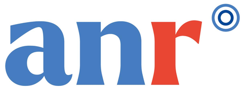
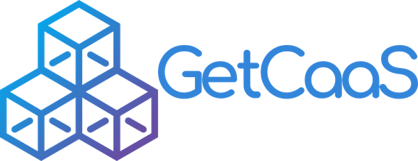
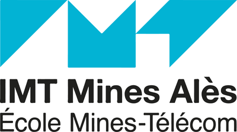
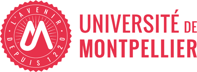
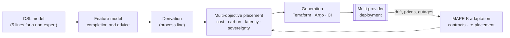

# amlops: Adaptive MLOps DSL (ANR AdaptiveMLOps, industrial partner prototype)

<p align="center">
  <a href="https://anr.fr/Projet-ANR-24-IAS2-0004"></a>&nbsp;&nbsp;&nbsp;
  <a href="https://dhm.euromov.eu/"></a>&nbsp;&nbsp;&nbsp;
  <a href="https://www.lirmm.fr/"></a>&nbsp;&nbsp;&nbsp;
  <a href="https://www.getcaas.io/"><picture><source media="(prefers-color-scheme: dark)" srcset="docs/assets/logos/getcaas-white.png"></picture></a>
</p>

**English** | [Français](README.fr.md)

`amlops` compiles a short, variability-aware description of an MLOps pipeline into
Infrastructure- and Platform-as-Code (Terraform, Argo Workflows / Argo Events,
Kubernetes, CI), places its steps across several cloud providers under cost /
carbon / latency / sovereignty objectives, and adapts it at run time (drift
detection, executable coordination contracts, re-placement).

It is the GetCaaS contribution to the ANR project **AdaptiveMLOps**
(ANR-24-IAS2-0004) and builds on the consortium's results:
the six variability categories and requirements R1–R8 of *Toward Adaptive MLOps:
Variability Mapping and Modeling* (GdR GPL 2025, hal-05127859) and the 38
activities and coordination contracts of **SkeltyMLOps** (MLOps@ECAI 2025,
hal-05337700; FGCS 185 (2026) 108700).

> **Status: research prototype, v0.1.** The provider catalogue
> (`src/amlops/knowledge/providers.yaml`) contains *illustrative* prices, power
> draws and grid intensities, and the dynamic experiments use *synthetic* traces.
> Generated Terraform/Kubernetes artefacts are parsed and unit-tested but have not
> been deployed. The feature model and rules are a proposal awaiting consortium review.

## The AdaptiveMLOps project

| | |
|---|---|
| Title | *MLOps Adaptatif* (**AdaptiveMLOps**) |
| Funding | French National Research Agency (ANR), grant **ANR-24-IAS2-0004** |
| Call | AAP 2024 *Thématiques Spécifiques en Intelligence Artificielle* (TSIA): Machine Learning Operations, Software Engineering for AI |
| ANR contribution | €489,646 |
| Start / duration | September 2024 / 48 months |
| Coordinator | Sylvain Vauttier (EuroMov Digital Health in Motion) |

**Objective.** MLOps extends DevOps principles to data science and machine
learning so that AI models are trained, deployed and operated as ordinary software
components. A key issue is the *continuous training* of models to adapt them to
changes observed in production data (data and concept drift). AdaptiveMLOps studies
how domain-engineering concepts (feature models, software product lines) can
capture the commonalities of MLOps processes and document best practices, and uses
this knowledge to guide the design of new pipelines through a model-driven
approach: a Domain Specific Language that is (i) generic and extensible, (ii)
abstract enough for non-expert users, (iii) open to fine-tuning by experts, and
(iv) pivotal to generate Platform-as-Code / Infrastructure-as-Code. The project
targets automatic and dynamic (re)deployment of pipeline components hosted by
several providers, optimising efficiency, cost and environmental footprint.
Proposals are prototyped and validated through proofs of concept on the
industrial partner's cloud platform.

**Consortium.**

| Partner | Role | Website |
|---|---|---|
| EuroMov Digital Health in Motion (EuroMov DHM), Université de Montpellier & IMT Mines Alès | Coordinator | <https://dhm.euromov.eu/> |
| LIRMM, Laboratoire d'Informatique, de Robotique et de Microélectronique de Montpellier (Université de Montpellier, CNRS) | Academic partner | <https://www.lirmm.fr/> |
| GetCaaS | Industrial partner (this repository) | <https://www.getcaas.io/> |

<p align="center">
  <a href="https://www.imt-mines-ales.fr/"></a>&nbsp;&nbsp;&nbsp;
  <a href="https://www.umontpellier.fr/"></a>&nbsp;&nbsp;&nbsp;
  <a href="https://www.cnrs.fr/"></a>
</p>

**Official links.**
- ANR project page: <https://anr.fr/Projet-ANR-24-IAS2-0004>
- Project website: <https://adaptivemlops.wp.imt.fr/>
- IMT Mines Alès: <https://www.imt-mines-ales.fr/>, Université de Montpellier: <https://www.umontpellier.fr/>, CNRS: <https://www.cnrs.fr/>

**Consortium publications this work builds on.**
- C. El Hatimi et al., *Toward Adaptive MLOps: Variability Mapping and Modeling*, GdR GPL national days, Pau, 2025. <https://hal.science/hal-05127859>
- C. Daoud et al., *SkeltyMLOps: Orchestrating Collaborative MLOps Activities*, MLOps25 @ ECAI 2025, CEUR-WS vol. 4109. <https://hal.science/hal-05337700>
- C. Daoud et al., *A reference architecture for an orchestrated collaborative MLOps*, Future Generation Computer Systems 185 (2026) 108700. <https://doi.org/10.1016/j.future.2026.108700>

## Overview



Detailed scientific and software architecture, with diagrams of the feature model,
the process line, the placement problem, the adaptation loop and the coordination
contracts: [docs/ARCHITECTURE.md](docs/ARCHITECTURE.md).

## Roadmap

Planned work for the second half of the project (M25 to M48), by axis and priority: [ROADMAP.md](ROADMAP.md).

## Quick start

```bash
pip install -e ".[dev,experiments]"
amlops knowledge                                         # what the knowledge base contains
amlops validate examples/churn_novice.amlops.yaml        # best-practice findings
amlops place    examples/churn_novice.amlops.yaml --pareto
amlops generate examples/churn_novice.amlops.yaml -o out/churn
amlops simulate examples/predictive_maintenance_expert.amlops.yaml
pytest -q                                                # 35 tests
python experiments/run_all.py                            # regenerates all paper numbers
```

A non-expert model is five lines:

```yaml
amlops: "0.1"
pipeline: churn-prediction
profile: tabular-classification-continuous
data: {source: "s3://datalake/crm/churn.parquet", volume_gb: 40}
objectives: {cost: 0.6, carbon: 0.4}
```

Experts refine features, steps, triggers, placement and parameters (see
`examples/predictive_maintenance_expert.amlops.yaml` and `docs/DSL.md`).

## Mapping to the project call

| Project requirement | Where |
|---|---|
| Feature models / product lines to capture commonalities | `knowledge/mlops_feature_model.yaml`, `variability/` |
| Documented best practices guiding design | `knowledge/best_practices.yaml`, `variability/advisor.py` |
| (i) generic, extensible DSL | step-kind & generator registries, `amlops.step_kinds` entry points |
| (ii) abstract, ready-to-use by non-experts | profiles, `examples/churn_novice.amlops.yaml` |
| (iii) parameterisation by experts | `features`, `steps`, `overrides` |
| (iv) pivotal model → PaC/IaC | `dsl/derivation.py`, `generators/` (+ `trace.json`) |
| Continuous training on drift | `adaptation/drift.py`, contracts, Argo sensors |
| Dynamic multi-provider (re)deployment, cost / footprint | `placement/optimizer.py`, `placement/dynamic.py` |

## Repository layout

```
src/amlops/
  knowledge/     feature model, rules, profiles, 38 SkeltyMLOps activities, provider catalogue
  variability/   feature-model semantics, configuration completion, advisor
  dsl/           metamodel, YAML parser, registry, derivation (process-line base model)
  placement/     exact multi-objective placement, Pareto front, dynamic policies simulator
  generators/    Terraform, Kubernetes/Argo, GitHub Actions, traceability
  adaptation/    PSI/KS drift detection, executable coordination contracts, MAPE-K loop
examples/        four illustrative case studies (+ generated output of one)
experiments/     run_all.py and results/*.json
paper/           LaTeX sources (main.tex, EN; main_fr.tex, FR); generated/; figures/
scripts/         git hooks (run `sh scripts/install-hooks.sh` after cloning)
```

## Citation / licence
Apache-2.0 © 2026 GetCaaS SARL. See `CITATION.cff`. The accompanying paper
(`paper/main.tex`) is a draft for consortium review: do not circulate before the
publication review foreseen by the consortium agreement.

## Acknowledgements
This work is supported by the French National Research Agency (ANR) under grant
ANR-24-IAS2-0004 (AdaptiveMLOps).
