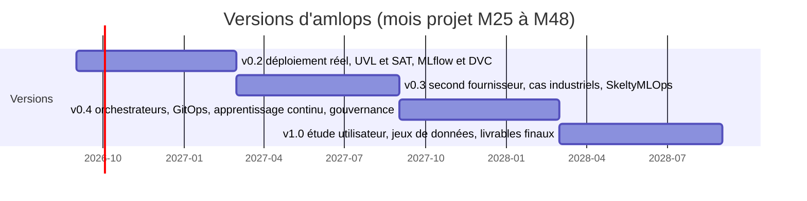

# Feuille de route

[English](ROADMAP.md) | **Français**

La version 0.1 démontre toute la chaîne (connaissance, DSL, dérivation, placement,
génération, adaptation), mais sur des données synthétiques, sans déploiement réel et
sans passerelles vers les formalismes des partenaires académiques. Cette feuille de
route couvre la seconde moitié du projet ANR AdaptiveMLOps (M25 à M48, septembre 2026
à août 2028). C'est une proposition du partenaire industriel, à discuter avec le
consortium : tout n'a pas vocation à être réalisé, et les priorités vont de **P1**
(indispensable à la validation industrielle promise par le projet) à **P3**
(souhaitable si le temps le permet).

## Principes

- **Ne pas dupliquer les travaux académiques.** Le métamodèle, la vue processus
  (BPMN) et l'orchestrateur SkeltyMLOps relèvent des partenaires académiques ;
  `amlops` fournit des passerelles (import, export, adaptateurs), pas des versions
  concurrentes.
- **Réel avant sophistiqué.** Remplacer les données synthétiques par des mesures et
  des déploiements réels avant d'ajouter des fonctionnalités.
- **Mesurable.** Chaque version s'accompagne d'une expérience reproductible dans
  `experiments/` et de tests.

## Axes

### A. Validation industrielle sur plateforme réelle (P1)

| Id | Élément |
|---|---|
| A1 | Déploiement de bout en bout des artefacts générés sur Scaleway (Kapsule, Argo), tests de fumée automatisés, journaux et durées de déploiement |
| A2 | Modules Terraform réels pour un second fournisseur (OVHcloud ou Outscale), puis un scénario multi-fournisseurs effectivement déployé |
| A3 | Catalogue alimenté par des sources réelles : API de tarification, intensité carbone horodatée (données ouvertes RTE éco2mix pour la France, electricityMaps pour l'Europe), consommation mesurée des nœuds (Kepler ou Scaphandre) |
| A4 | Empreinte intrinsèque via l'API Boavizta, pour lever la limite « carbone opérationnel seulement » |
| A5 | Deux à trois cas d'étude industriels anonymisés décrits dans le DSL, avec leurs contraintes réelles de souveraineté, de coût et de conformité |

### B. Passerelles vers les formalismes du consortium (P1)

| Id | Élément |
|---|---|
| B1 | Export et import du feature model aux formats UVL (Universal Variability Language) et FeatureIDE |
| B2 | Analyse par solveur SAT : features mortes, fausses optionnelles, comptage des configurations valides, explication minimale des conflits |
| B3 | Export du pipeline résolu et de ses contrats vers le format de processus retenu par les partenaires (BPMN 2.0 ou autre), et import de leurs variantes de processus |
| B4 | Adaptateur vers l'orchestrateur de processus MLOps de SkeltyMLOps : tickets et contrats d'`amlops` exécutés comme instances de l'orchestrateur |
| B5 | Export du métamodèle (schéma JSON, puis Ecore si le consortium le retient) |

### C. Couverture des outils et features inertes (P2)

| Id | Élément |
|---|---|
| C1 | Générateurs pour le suivi d'expériences (MLflow) et le versionnement des données (DVC ou lakeFS) |
| C2 | Générateurs pour d'autres orchestrateurs (Kubeflow Pipelines, Airflow) et runtimes (conteneurs serverless) |
| C3 | Déploiement GitOps (Argo CD) avec détection de dérive de configuration |
| C4 | Magasin de features (Feast) comme point de variation optionnel |

Indicateur : features feuilles avec effet observable (34 sur 50 en v0.1) et
activités SkeltyMLOps réalisées par les artefacts générés (21 sur 38 en v0.1).

### D. Adaptation et apprentissage continu (P2)

| Id | Élément |
|---|---|
| D1 | Détecteurs de dérive éprouvés (Evidently, Alibi Detect, River pour les flux) et étiquettes retardées pour la dérive de concept |
| D2 | Replacement déclenché par événements (panne, changement de prix ou de catalogue) et règle de retour après une panne |
| D3 | Tickets concurrents et priorités entre contrats (question ouverte dans SkeltyMLOps, FGCS 2026) |
| D4 | Stratégies d'apprentissage continu (incrémental, fenêtre glissante) avec retour arrière contrôlé du modèle |
| D5 | Placement de plusieurs pipelines partageant des clusters sous contraintes de capacité ; séparation et évaluation comparée à une formulation en programmation linéaire en nombres entiers |

### E. Gouvernance, conformité et traçabilité (P2)

| Id | Élément |
|---|---|
| E1 | Squelette généré de la documentation technique exigée pour les systèmes d'IA à haut risque (AI Act) et fiches modèles |
| E2 | Traces d'exécution signées, attestations de provenance des artefacts (in-toto, SLSA), nomenclature ML (CycloneDX ML-BOM) |
| E3 | Correspondance entre features organisationnelles et exigences d'ISO/IEC 42001, du RGPD, de HDS et de SecNumCloud |

### F. Utilisabilité et évaluation utilisateur (P2 à P3)

| Id | Élément |
|---|---|
| F1 | Schéma JSON du DSL pour la complétion et la validation dans les éditeurs, puis serveur de langage |
| F2 | Éditeur graphique ou bac à sable web pour les non-experts |
| F3 | Étude utilisateur avec non-experts et experts (tâches chronométrées, taux de réussite, SUS), DSL contre écriture manuelle des artefacts |

### G. Science ouverte (P1, continu)

| Id | Élément |
|---|---|
| G1 | Archivage Zenodo de chaque version avec DOI et paquet de réplication |
| G2 | Jeu de données public de traces de dérive et d'environnement anonymisées, et corpus de pipelines industriels pour valider le feature model |
| G3 | Paquet Python sur PyPI et documentation en ligne |

## Calendrier indicatif

| Version | Période | Contenu principal |
|---|---|---|
| 0.2 | M25 à M30 | A1, A3, A4, B1, B2, C1, F1, G1 |
| 0.3 | M30 à M36 | A2, A5, B3, B4, D1, D2, D3 |
| 0.4 | M36 à M42 | C2, C3, D4, D5, E1, E2, F2 |
| 1.0 | M42 à M48 | F3, G2, G3, B5, E3 |

## Hors périmètre

`amlops` n'a pas vocation à devenir une plateforme MLOps complète ni un service
hébergé : il ne réimplémente ni le suivi d'expériences, ni l'orchestration, ni le
service d'inférence, qu'il configure à partir du modèle. Il ne remplace pas le
métamodèle ni l'orchestrateur développés par les partenaires académiques.
