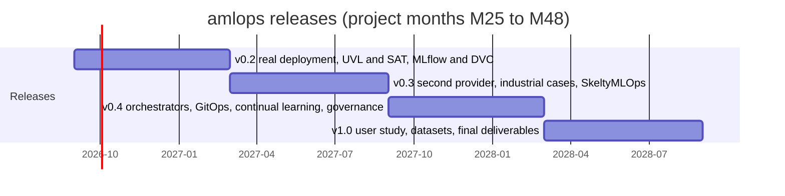

# Roadmap

**English** | [Français](ROADMAP.fr.md)

Version 0.1 demonstrates the whole chain (knowledge, DSL, derivation, placement,
generation, adaptation) but on synthetic data, without real deployment and without
bridges to the academic partners' formalisms. This roadmap covers the second half of
the ANR AdaptiveMLOps project (M25 to M48, September 2026 to August 2028). It is a
proposal from the industrial partner, to be discussed with the consortium: not
everything is meant to be built, and priorities go from **P1** (required for the
industrial validation promised by the project) to **P3** (desirable if time allows).

## Principles

- **Do not duplicate academic work.** The metamodel, the process (BPMN) view and the
  SkeltyMLOps orchestrator belong to the academic partners; `amlops` provides
  bridges (import, export, adapters), not competing versions.
- **Real before sophisticated.** Replace synthetic data with measurements and real
  deployments before adding features.
- **Measurable.** Every release ships with a reproducible experiment in
  `experiments/` and tests.

## Axes

### A. Industrial validation on a real platform (P1)

| Id | Item |
|---|---|
| A1 | End-to-end deployment of generated artefacts on Scaleway (Kapsule, Argo), automated smoke tests, deployment logs and durations |
| A2 | Real Terraform modules for a second provider (OVHcloud or Outscale), then an actually deployed multi-provider scenario |
| A3 | Catalogue fed by real sources: provider pricing APIs, time-stamped grid intensity (RTE éco2mix open data for France, electricityMaps for Europe), measured node power (Kepler or Scaphandre) |
| A4 | Embodied footprint through the Boavizta API, to lift the "operational carbon only" limitation |
| A5 | Two to three anonymised industrial case studies written in the DSL, with their real sovereignty, cost and compliance constraints |

### B. Bridges to the consortium's formalisms (P1)

| Id | Item |
|---|---|
| B1 | Feature model export and import in UVL (Universal Variability Language) and FeatureIDE formats |
| B2 | SAT-based analysis: dead features, false optionals, counting valid configurations, minimal conflict explanations |
| B3 | Export of the resolved pipeline and its contracts to the process format chosen by the partners (BPMN 2.0 or other), and import of their process variants |
| B4 | Adapter to the SkeltyMLOps MLOps process orchestrator: `amlops` tickets and contracts executed as orchestrator instances |
| B5 | Metamodel export (JSON Schema, then Ecore if the consortium adopts it) |

### C. Tool coverage and inert features (P2)

| Id | Item |
|---|---|
| C1 | Generators for experiment tracking (MLflow) and data versioning (DVC or lakeFS) |
| C2 | Generators for other orchestrators (Kubeflow Pipelines, Airflow) and runtimes (serverless containers) |
| C3 | GitOps deployment (Argo CD) with configuration drift detection |
| C4 | Feature store (Feast) as an optional variation point |

Indicator: leaf features with an observable effect (34 of 50 in v0.1) and
SkeltyMLOps activities realised by generated artefacts (21 of 38 in v0.1).

### D. Adaptation and continual learning (P2)

| Id | Item |
|---|---|
| D1 | Proven drift detectors (Evidently, Alibi Detect, River for streams) and delayed labels for concept drift |
| D2 | Event-driven re-placement (outage, price or catalogue change) and return-to-home rule after an outage |
| D3 | Concurrent tickets and priorities between contracts (open issue in SkeltyMLOps, FGCS 2026) |
| D4 | Continual learning strategies (incremental, sliding window) with controlled model rollback |
| D5 | Placement of several pipelines sharing clusters under capacity constraints; branch and bound compared with an integer linear programming formulation |

### E. Governance, compliance and traceability (P2)

| Id | Item |
|---|---|
| E1 | Generated skeleton of the technical documentation required for high-risk AI systems (EU AI Act) and model cards |
| E2 | Signed execution traces, artefact provenance attestations (in-toto, SLSA), ML bill of materials (CycloneDX ML-BOM) |
| E3 | Mapping between organisational features and requirements of ISO/IEC 42001, GDPR, HDS and SecNumCloud |

### F. Usability and user evaluation (P2 to P3)

| Id | Item |
|---|---|
| F1 | JSON Schema of the DSL for editor completion and validation, then a language server |
| F2 | Graphical editor or web playground for non-experts |
| F3 | User study with non-experts and experts (timed tasks, success rate, SUS), DSL versus hand-written artefacts |

### G. Open science (P1, continuous)

| Id | Item |
|---|---|
| G1 | Zenodo archiving of every release with a DOI and a replication package |
| G2 | Public dataset of anonymised drift and environment traces, and a corpus of industrial pipelines for feature model validation |
| G3 | Python package on PyPI and online documentation |

## Indicative schedule

| Release | Period | Main content |
|---|---|---|
| 0.2 | M25 to M30 | A1, A3, A4, B1, B2, C1, F1, G1 |
| 0.3 | M30 to M36 | A2, A5, B3, B4, D1, D2, D3 |
| 0.4 | M36 to M42 | C2, C3, D4, D5, E1, E2, F2 |
| 1.0 | M42 to M48 | F3, G2, G3, B5, E3 |

## Out of scope

`amlops` is not meant to become a full MLOps platform or a hosted service: it does
not reimplement experiment tracking, orchestration or model serving, which it
configures from the model. It does not replace the metamodel or the orchestrator
developed by the academic partners.
