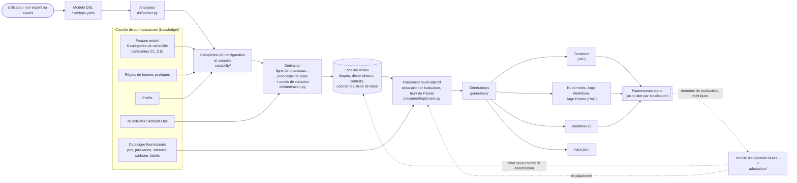
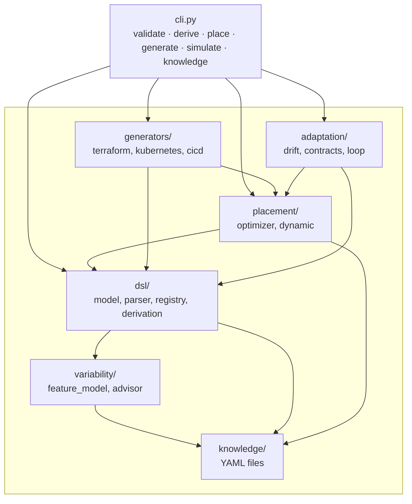
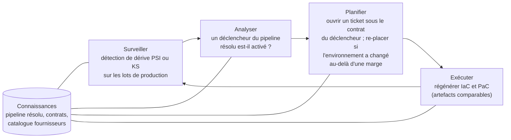
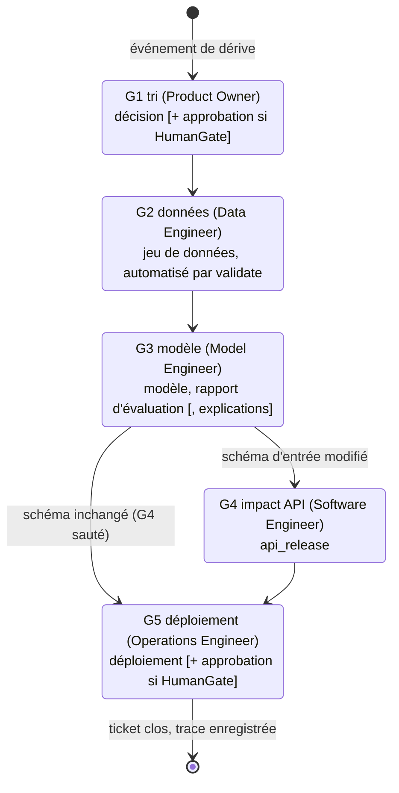
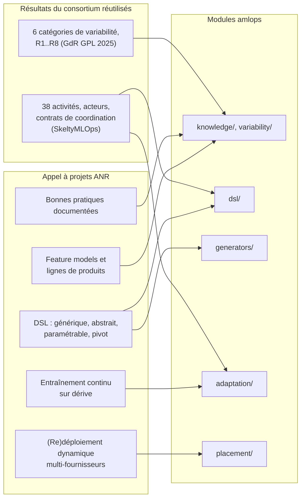

# Architecture

[English](ARCHITECTURE.md) | **Français**

Ce document décrit l'architecture scientifique et logicielle d'`amlops`, le
prototype de GetCaaS pour le projet ANR AdaptiveMLOps (ANR-24-IAS2-0004). Chaque
schéma reflète le code de la version 0.1 ; les chemins de modules sont relatifs à
`src/amlops/`.

## 1. Vue de bout en bout : d'un modèle DSL aux pipelines en exécution

La chaîne est déterministe : le même modèle, la même base de connaissances et le
même catalogue produisent toujours les mêmes artefacts, et `trace.json` relie chaque
élément généré à la feature, à la règle ou à l'énoncé utilisateur qui l'a causé.

## 2. Structure des paquets

Points d'extension : les nouveaux types d'étapes s'enregistrent avec
`register_step_kind` (ou via le point d'entrée `amlops.step_kinds`), les nouvelles
cibles avec `register_generator`. Aucun des deux ne nécessite de modifier le
métamodèle.

## 3. Modèle de variabilité

Le feature model suit la sémantique FODA (features obligatoires et optionnelles,
groupes XOR et OR, contraintes transversales propositionnelles analysées dans un
sous-ensemble sûr de l'`ast` Python). Ses six catégories de premier niveau sont les
catégories de variabilité d'El Hatimi et al. (GdR GPL 2025).

```mermaid
flowchart TB
    R["MLOpsPipeline"]
    R --> F["Functional"]
    R --> B["Behavioral"]
    R --> T["Technical"]
    R --> DS["DomainSpecific"]
    R --> NF["NonFunctional"]
    R --> O["Organizational"]
    F --> F1["MLTask (xor)<br/>classification, régression,<br/>prévision, détection d'anomalies"]
    F --> F2["Preprocessing (or)"]
    F --> F3["HyperparameterTuning ?"]
    F --> F4["Explainability ?"]
    B --> B1["TrainingTrigger (or)<br/>Manual, Scheduled, DriftTriggered,<br/>PerformanceTriggered, NewDataTriggered"]
    B --> B2["DeploymentStrategy (xor)<br/>Recreate, BlueGreen, Canary, Shadow"]
    B --> B3["HumanGate ?"]
    T --> T1["Orchestrator (xor)<br/>ArgoWorkflows, Kubeflow, Airflow"]
    T --> T2["Serving (xor)<br/>OnlineService, KServe, BatchScoring"]
    T --> T3["Runtime (xor)<br/>Kubernetes, Serverless"]
    T --> T4["GPU ?, ExperimentTracking ?, DataVersioning ?"]
    DS --> D1["Domain (xor)<br/>Generic, Industry40IoT, Healthcare,<br/>Retail, Finance"]
    NF --> N1["Objectives (or)<br/>CostOptimized, CarbonAware,<br/>LatencyCritical"]
    NF --> N2["Monitoring (or)<br/>dérive de données, de concept, infra"]
    O --> O1["Sovereignty (xor)<br/>NoResidencyConstraint,<br/>EUResidency, SecNumCloud"]
    O --> O2["Compliance (or)<br/>GDPR, HDS, AIActHighRisk"]
```

`?` marque les features optionnelles. Exemples de contraintes transversales
(`knowledge/mlops_feature_model.yaml`) :

| Id | Contrainte | Justification |
|---|---|---|
| C1 | ¬(ClassificationBaseline ∧ DimReduction) | exemple rapporté dans le poster GdR GPL 2025 |
| C2 | DriftTriggered ⇒ DataDriftMonitoring ∨ ConceptDriftMonitoring | un déclencheur de dérive exige un signal de dérive |
| C6 | Healthcare ⇒ HDS ∧ ¬NoResidencyConstraint | hébergement de données de santé (HDS) |
| C8 | AIActHighRisk ⇒ HumanGate ∧ Explainability | contrôle humain et transparence |

**Complétion de configuration.** Une sélection partielle est complétée par un
parcours en profondeur préfixe avec évaluation trivaluée de Kleene des contraintes,
qui élague une branche dès qu'une contrainte est certainement fausse. La complétion
est minimale : les features sont d'abord essayées à faux, sauf celles marquées
`default: true`, essayées d'abord à vrai. Le conseiller applique ensuite les règles
de bonnes pratiques et rapporte des constats avec des corrections proposées.

## 4. Dérivation : une ligne de processus logiciels

La dérivation suit la vue « ligne de processus logiciels » du consortium : un
processus de base dont les points de variation (VP) sont liés par les features
sélectionnées. Chaque élément créé reçoit un `TraceLink` vers sa cause.

```mermaid
flowchart LR
    I["ingest"] --> V["validate"]
    V --> VP1{{"VP Preprocess<br/>impute · remove_outliers · normalize ·<br/>select_features · reduce_dims"}}
    VP1 --> TU["tune ?"]
    TU --> TRN["train<br/>(GPU ?, différable si CarbonAware)"]
    TRN --> EV["evaluate"]
    EV --> EX["explain ?"]
    EX --> REG["register"]
    REG --> AP["approve ?<br/>(HumanGate)"]
    AP --> VP2{{"VP Deploy<br/>deploy_test si BlueGreen,<br/>Canary ou Shadow ; deploy"}}
    VP2 --> VP3{{"VP Serve<br/>OnlineService · KServe ·<br/>BatchScoring"}}
    VP3 --> VP4{{"VP Monitor<br/>dérive de données · dérive de concept ·<br/>infrastructure"}}
```

Après le processus de base, les étapes définies par l'utilisateur sont fusionnées,
les déclencheurs et contrats de coordination sont dérivés, les features
organisationnelles deviennent des labels de placement (par exemple `HDS` ajoute les
labels `EU` et `HDS`), les `overrides` experts sont appliqués, et le résultat est
vérifié (absence de cycles et de références pendantes).

## 5. Placement multi-objectif

Chaque étape *s* est affectée à une offre *o(s)* (fournisseur, région, type
d'instance) du catalogue, sous contraintes dures (labels requis, fournisseurs
autorisés, épinglages, groupes de co-localisation, latence maximale). L'objectif est
une somme pondérée de critères normalisés :

$$
J = w_c \frac{\sum_s c_{s,o(s)} + E}{C^\*} + w_g \frac{\sum_s g_{s,o(s)}}{G^\*} + w_\ell \frac{\sum_s \ell_{s,o(s)}}{L^\*}
$$

où *c*, *g* et *ℓ* sont le coût mensuel, le carbone opérationnel (kg CO₂e, énergie
multipliée par l'intensité du réseau) et la latence d'une étape sur une offre, *E*
le coût d'egress des données entre localisations différentes, et *C\**, *G\**,
*L\** les sommes des minima par étape. Les poids sont les `objectives` normalisés du
modèle, donc *J* ≥ 1, et *J* = 1 signifierait que chaque étape atteint son optimum
individuel.

L'optimum est calculé exactement par séparation et évaluation sur les étapes en
ordre topologique. La borne est admissible (objectif partiel plus la somme des
minima par étape des étapes restantes) et les candidats sont réduits par dominance
au niveau de la localisation, puisque l'egress et la co-localisation ne dépendent
que de la localisation. Un budget de nœuds signale les optima non prouvés. Faire
varier les poids donne le front de Pareto (`amlops place --pareto`).

## 6. Adaptation à l'exécution : boucle MAPE-K

## 7. Contrats de coordination exécutables

Le modèle de coordination de SkeltyMLOps (Daoud et al., FGCS 2026, sect. 5.8 et
5.9) est rendu exécutable : un ticket avance de porte en porte uniquement lorsque
l'acteur responsable soumet les artefacts requis et, si demandé, une approbation.
Les portes conditionnelles sont sautées quand leur condition est fausse. Chaque
transition est enregistrée dans une trace JSON.

Un second contrat, `scheduled-retraining`, couvre les déclencheurs planifiés avec
les portes données, modèle et déploiement.

## 8. Politiques de re-placement dynamique

Le simulateur (`placement/dynamic.py`) rejoue des traces horaires d'intensité
carbone et de disponibilité pour le groupe de service et les tâches
d'entraînement différables.

| Politique | Décision de service à chaque heure | Rôle |
|---|---|---|
| static | conserver la localisation initiale ; déplacement forcé en cas de panne, retour ensuite | référence |
| reactive | aller vers la meilleure localisation courante | borne haute des migrations |
| hysteresis | ne migrer que si le gain prévu sur une fenêtre d'anticipation dépasse le coût de migration multiplié par (1 + marge) | proposée |
| oracle | programmation dynamique sur les localisations avec coûts de changement et futur réel | borne basse |

Les prévisions sont de type saisonnier naïf. Le coût de migration est une pénalité
fixe plus l'egress.

## 9. Traçabilité vers l'appel à projets et les résultats du consortium

## Limites connues (v0.1)

- Pas encore de métamodèle Ecore ni de vue BPMN ; ce sont des passerelles
  naturelles vers la modélisation en lignes de processus des partenaires
  académiques.
- Les générateurs ne ciblent qu'Argo sur Kubernetes ; rien n'est encore généré pour
  le suivi d'expériences ni le versionnement des données.
- Le catalogue fournisseurs contient des valeurs illustratives et les expériences
  dynamiques utilisent des traces synthétiques ; les artefacts générés sont analysés
  et testés unitairement, pas déployés.
- L'hystérésis n'a pas de règle de retour à la localisation d'origine après un
  déplacement forcé par une panne ; la disponibilité est supposée connue lors de la
  planification des tâches.
