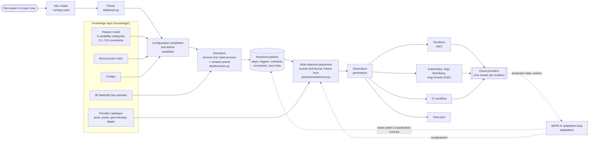
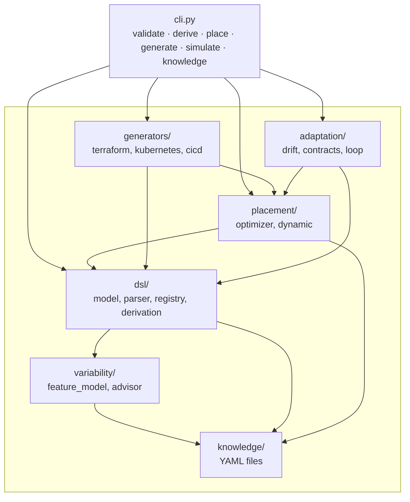
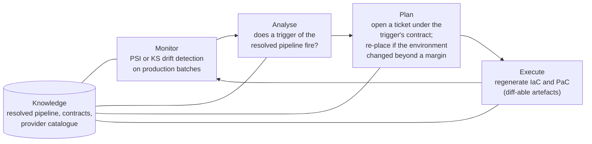
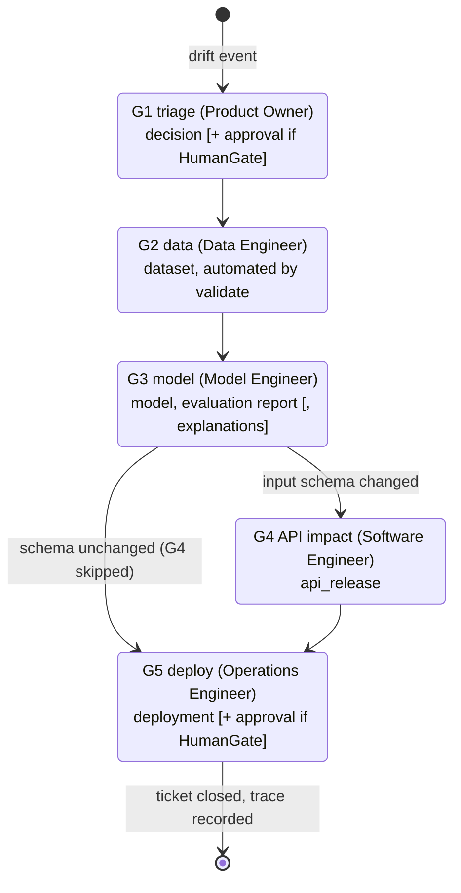
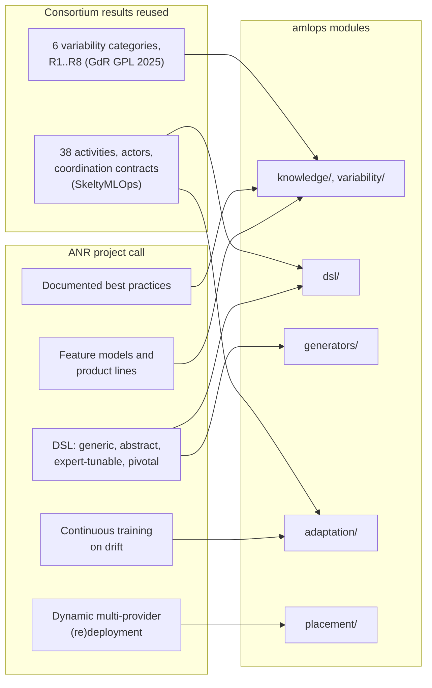

# Architecture

**English** | [Français](ARCHITECTURE.fr.md)

This document describes the scientific and software architecture of `amlops`, the
GetCaaS prototype for the ANR project AdaptiveMLOps (ANR-24-IAS2-0004). Every
diagram reflects the code of version 0.1; module paths are relative to
`src/amlops/`.

## 1. End-to-end view: from a DSL model to running pipelines

The chain is deterministic: the same model, knowledge base and catalogue always
produce the same artefacts, and `trace.json` links every generated element to the
feature, rule or user statement that caused it.

## 2. Package structure

Extension points: new step kinds are registered with `register_step_kind` (or
through the `amlops.step_kinds` entry point), new targets with
`register_generator`. Neither requires changing the metamodel.

## 3. Variability model

The feature model follows FODA semantics (mandatory and optional features, XOR and
OR groups, propositional cross-tree constraints parsed from a safe subset of the
Python `ast`). Its six top-level categories are the variability categories of
El Hatimi et al. (GdR GPL 2025).

```mermaid
flowchart TB
    R["MLOpsPipeline"]
    R --> F["Functional"]
    R --> B["Behavioral"]
    R --> T["Technical"]
    R --> DS["DomainSpecific"]
    R --> NF["NonFunctional"]
    R --> O["Organizational"]
    F --> F1["MLTask (xor)<br/>classification, regression,<br/>forecasting, anomaly detection"]
    F --> F2["Preprocessing (or)"]
    F --> F3["HyperparameterTuning ?"]
    F --> F4["Explainability ?"]
    B --> B1["TrainingTrigger (or)<br/>Manual, Scheduled, DriftTriggered,<br/>PerformanceTriggered, NewDataTriggered"]
    B --> B2["DeploymentStrategy (xor)<br/>Recreate, BlueGreen, Canary, Shadow"]
    B --> B3["HumanGate ?"]
    T --> T1["Orchestrator (xor)<br/>ArgoWorkflows, Kubeflow, Airflow"]
    T --> T2["Serving (xor)<br/>OnlineService, KServe, BatchScoring"]
    T --> T3["Runtime (xor)<br/>Kubernetes, Serverless"]
    T --> T4["GPU ?, ExperimentTracking ?, DataVersioning ?"]
    DS --> D1["Domain (xor)<br/>Generic, Industry40IoT, Healthcare,<br/>Retail, Finance"]
    NF --> N1["Objectives (or)<br/>CostOptimized, CarbonAware,<br/>LatencyCritical"]
    NF --> N2["Monitoring (or)<br/>Data drift, Concept drift, Infra"]
    O --> O1["Sovereignty (xor)<br/>NoResidencyConstraint,<br/>EUResidency, SecNumCloud"]
    O --> O2["Compliance (or)<br/>GDPR, HDS, AIActHighRisk"]
```

`?` marks optional features. Examples of cross-tree constraints
(`knowledge/mlops_feature_model.yaml`):

| Id | Constraint | Rationale |
|---|---|---|
| C1 | ¬(ClassificationBaseline ∧ DimReduction) | example reported in the GdR GPL 2025 poster |
| C2 | DriftTriggered ⇒ DataDriftMonitoring ∨ ConceptDriftMonitoring | a drift trigger needs a drift signal |
| C6 | Healthcare ⇒ HDS ∧ ¬NoResidencyConstraint | French health data hosting |
| C8 | AIActHighRisk ⇒ HumanGate ∧ Explainability | human oversight and transparency |

**Configuration completion.** A partial selection is completed by a pre-order
depth-first search with Kleene three-valued evaluation of the constraints, which
prunes a branch as soon as a constraint is certainly false. Completion is minimal:
features are tried false first, except features marked `default: true`, which are
tried true first. The advisor then applies best-practice rules and reports
findings with suggested fixes.

## 4. Derivation: a software process line

Derivation follows the software process line view of the consortium: a base
process whose variation points (VP) are bound by the selected features. Every
created element receives a `TraceLink` to its cause.

```mermaid
flowchart LR
    I["ingest"] --> V["validate"]
    V --> VP1{{"VP Preprocess<br/>impute · remove_outliers · normalize ·<br/>select_features · reduce_dims"}}
    VP1 --> TU["tune ?"]
    TU --> TRN["train<br/>(GPU ?, deferrable if CarbonAware)"]
    TRN --> EV["evaluate"]
    EV --> EX["explain ?"]
    EX --> REG["register"]
    REG --> AP["approve ?<br/>(HumanGate)"]
    AP --> VP2{{"VP Deploy<br/>deploy_test if BlueGreen,<br/>Canary or Shadow; deploy"}}
    VP2 --> VP3{{"VP Serve<br/>OnlineService · KServe ·<br/>BatchScoring"}}
    VP3 --> VP4{{"VP Monitor<br/>data drift · concept drift ·<br/>infrastructure"}}
```

After the base process, user-defined steps are merged, triggers and coordination
contracts are derived, organisational features become placement labels (for
instance `HDS` adds the labels `EU` and `HDS`), expert `overrides` are applied, and
the result is checked for cycles and dangling references.

## 5. Multi-objective placement

Each step *s* is assigned to an offer *o(s)* (provider, region, instance type) from
the catalogue, subject to hard constraints (required labels, allowed providers,
pins, co-location groups, maximum latency). The objective is a weighted sum of
normalised criteria:

$$
J = w_c \frac{\sum_s c_{s,o(s)} + E}{C^\*} + w_g \frac{\sum_s g_{s,o(s)}}{G^\*} + w_\ell \frac{\sum_s \ell_{s,o(s)}}{L^\*}
$$

where *c*, *g* and *ℓ* are the monthly cost, operational carbon (kg CO₂e, energy
times grid intensity) and latency of a step on an offer, *E* is the data egress
cost between different locations, and *C\**, *G\**, *L\** are the sums of per-step
minima. The weights are the normalised `objectives` of the model, so *J* ≥ 1 and
*J* = 1 would mean every step reaches its individual optimum.

The optimum is computed exactly by branch and bound over steps in topological
order. The bound is admissible (partial objective plus the sum of per-step minima
of the remaining steps) and candidates are reduced by location-level dominance,
since egress and co-location only depend on the location. A node budget flags
non-proven optima. Varying the weights yields the Pareto front
(`amlops place --pareto`).

## 6. Run-time adaptation: MAPE-K loop

## 7. Executable coordination contracts

The coordination model of SkeltyMLOps (Daoud et al., FGCS 2026, Sect. 5.8 and 5.9)
is made executable: a ticket moves gate by gate only when the owning actor submits
the required artefacts and, where requested, an approval. Conditional gates are
skipped when their condition is false. Every transition is recorded in a JSON
trace.

A second contract, `scheduled-retraining`, covers scheduled triggers with the gates
data, model and deploy.

## 8. Dynamic re-placement policies

The simulator (`placement/dynamic.py`) replays hourly grid intensity and
availability traces for the serving group and the deferrable training jobs.

| Policy | Serving decision at each hour | Role |
|---|---|---|
| static | keep the initial location; forced move on outage, return home afterwards | baseline |
| reactive | move to the current best location | upper bound on churn |
| hysteresis | move only if the forecast gain over a look-ahead window exceeds the migration cost times (1 + margin) | proposed |
| oracle | dynamic programming over locations with switching costs and the true future | lower bound |

Forecasts are seasonal-naive. Migration cost is a fixed penalty plus egress.

## 9. Traceability to the project call and to consortium results

## Known limitations (v0.1)

- No Ecore metamodel and no BPMN view yet; both are natural bridges to the
  academic partners' process-line modelling.
- Generators target Argo on Kubernetes only; nothing is generated yet for
  experiment tracking or data versioning.
- The provider catalogue holds illustrative values and the dynamic experiments use
  synthetic traces; generated artefacts are parsed and unit-tested, not deployed.
- Hysteresis has no return-to-home rule after an outage-forced move; availability
  is assumed known when scheduling jobs.
